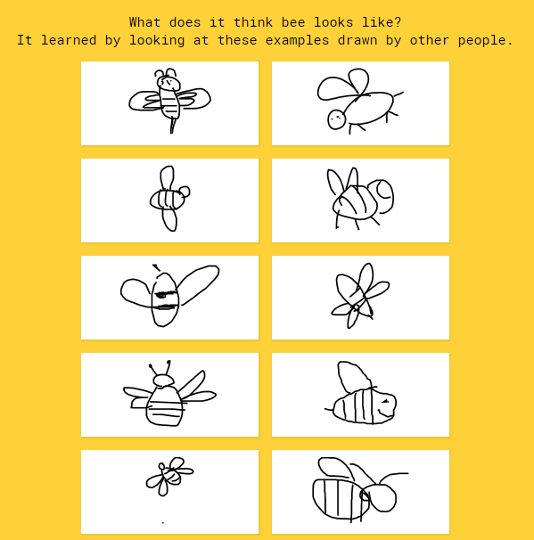

    <h1># datathon2023-pictionary-challenge</h1>

# Contents
- [Pictionary Plunge About](#Pictionary-Plunge-About)
- [Install Google Cloud SDK](#Install-Google-Cloud-SDK)
- [Install Data](#Install-Data)
- [View Data](#View-Data)
- [Project Structure](#Project-Structure)

## Pictionary Plunge About
The Pictionary Plunge is based off the Quick! Draw Challenge released by Google in 2016. A machine learning model will make classification of what the doodle is as the user makes the drawing.

## Install GCloud SDK
https://cloud.google.com/sdk/docs/install

## Install Data
gsutil -m cp 'gs://quickdraw_dataset/full/simplified/*.ndjson' .

## View Data
https://quickdraw.withgoogle.com/data

## Project Structure

### 1. Convert Stroke Maps to Image Map
Input drawings will initally be in the form of multidimensional arrays for each stroke, which is defined as a continous line where the pen does not lift from the drawing board. The values will include an x array and a y array. Converting the stroke maps to an image involves converting to binary where 0s and 1s represent the absense of strokes

### 2. Build a convolutional Neural Network layers for the images
Alternate between convolutional layer and Max/Mean Pooling 2D

### 3. Flatten into 1D vector with built-in flatten function
Call the flatten function to flatten to 1 dimensional array

### 4. LSTM/Hddien Layers
These hidden layers will utilize batch normalization, activation functions, and the final softmax categorization layer

### 5. Compare accuracy with pretrained models
Compare the completed model with pretrained models, MobileNet, ResNet, and VGG and take the model with the highest accuracy

### 6. Make Predictions and edit hyperparameters
Adjust hyperparameters to obtain highest accuracy. This step applies dropout and regularization in the neural network architecture

### 7. Apply transfer learning to new dataset categories with trained model
Save the weights of the trained model and adjust the learning rate so the weights will not be destroyed. Apply transfer learning to the new model.

### 8. If test data isin't normalized, create functions to fix the data
